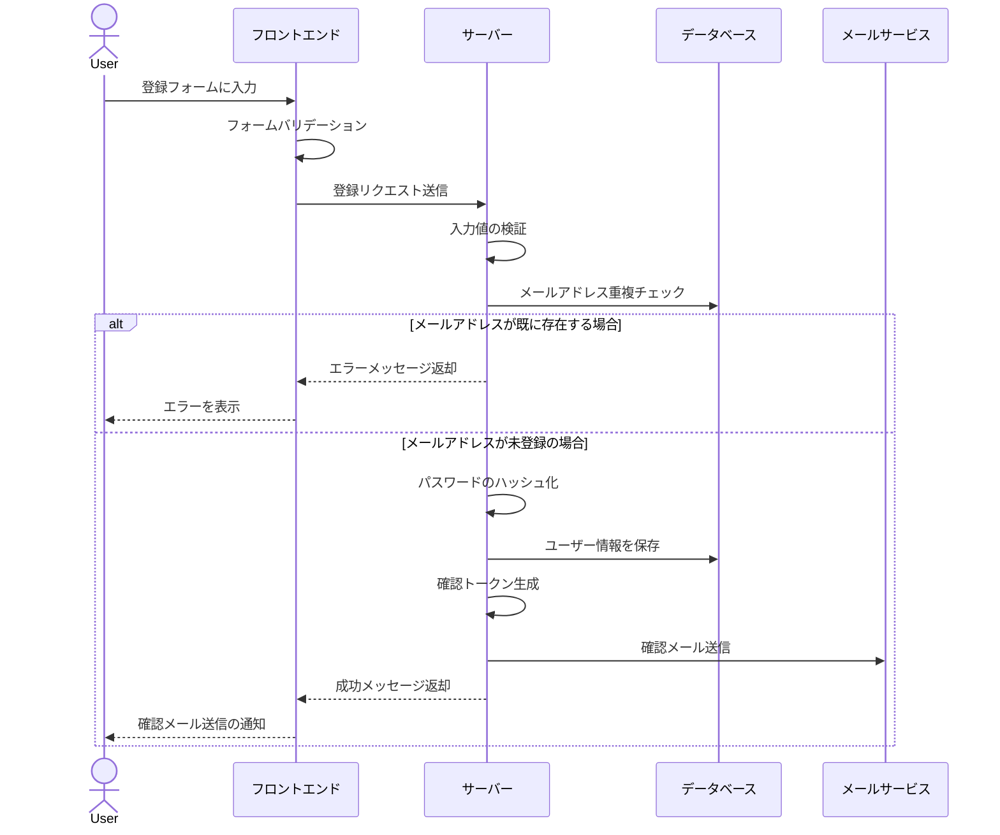
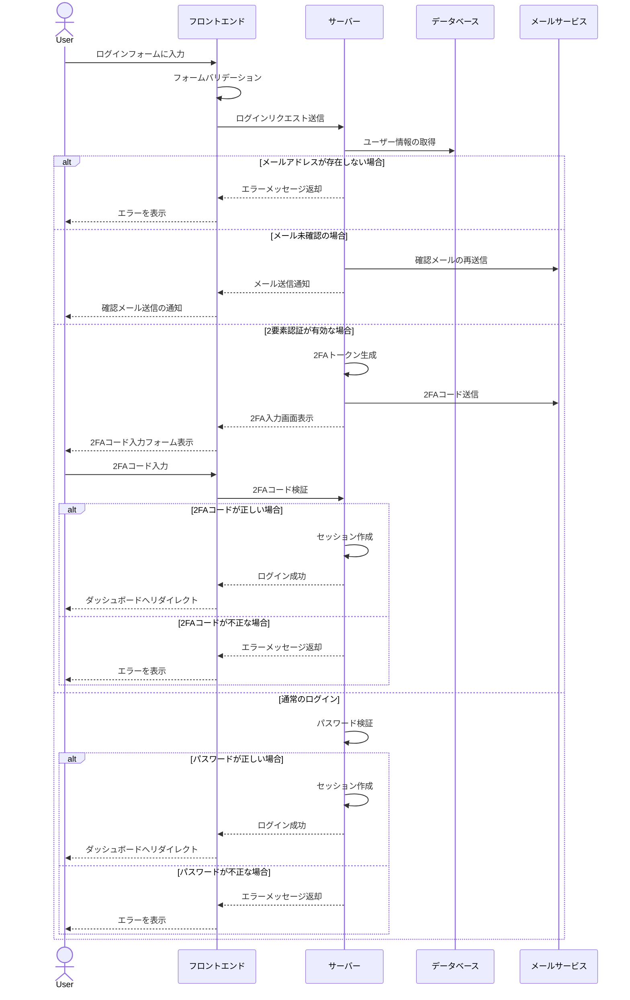
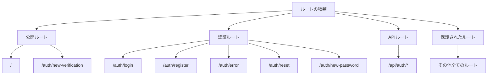
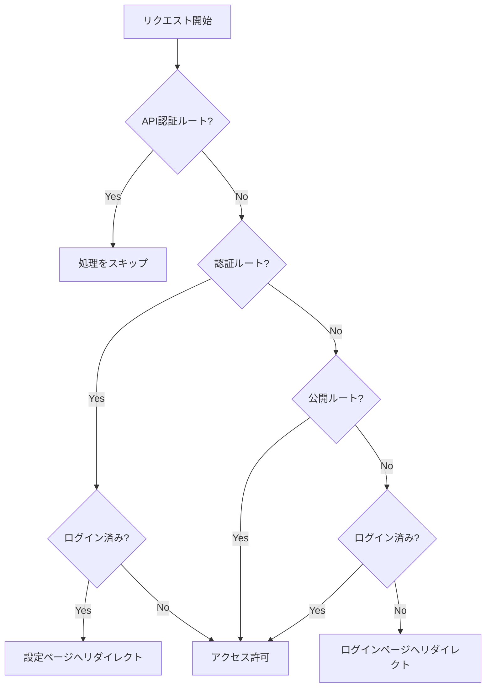

# Next.js Authentication System

# Next Auth v5 - Advanced Guide (2024)


This is a repository for Next Auth v5 - Advanced Guide (2024)

[VIDEO TUTORIAL](https://youtu.be/1MTyCvS05V4)

Key Features:
- 🔐 Next-auth v5 (Auth.js)
- 🚀 Next.js 14 with server actions
- 🔑 Credentials Provider
- 🌐 OAuth Provider (Social login with Google & GitHub)
- 🔒 Forgot password functionality
- ✉️ Email verification
- 📱 Two factor verification
- 👥 User roles (Admin & User)
- 🔓 Login component (Opens in redirect or modal)
- 📝 Register component
- 🤔 Forgot password component
- ✅ Verification component
- ⚠️ Error component
- 🔘 Login button
- 🚪 Logout button
- 🚧 Role Gate
- 🔍 Exploring next.js middleware
- 📈 Extending & Exploring next-auth session
- 🔄 Exploring next-auth callbacks
- 👤 useCurrentUser hook
- 🛂 useRole hook
- 🧑 currentUser utility
- 👮 currentRole utility
- 🖥️ Example with server component
- 💻 Example with client component
- 👑 Render content for admins using RoleGate component
- 🛡️ Protect API Routes for admins only
- 🔐 Protect Server Actions for admins only
- 📧 Change email with new verification in Settings page
- 🔑 Change password with old password confirmation in Settings page
- 🔔 Enable/disable two-factor auth in Settings page
- 🔄 Change user role in Settings page (for development purposes only)

### Prerequisites

**Node version 18.7.x**

### Cloning the repository

```shell
git clone https://github.com/AntonioErdeljac/next-auth-v5-advanced-guide.git
```

### Install packages

```shell
npm i
```

### Setup .env file


```js
DATABASE_URL=
DIRECT_URL=

AUTH_SECRET=

GITHUB_CLIENT_ID=
GITHUB_CLIENT_SECRET=

GOOGLE_CLIENT_ID=
GOOGLE_CLIENT_SECRET=

RESEND_API_KEY=

NEXT_PUBLIC_APP_URL=
```

### Setup Prisma
```shell
npx prisma generate
npx prisma db push
```

### Start the app

```shell
npm run dev
```

## Available commands

Running commands with npm `npm run [command]`

| command         | description                              |
| :-------------- | :--------------------------------------- |
| `dev`           | Starts a development instance of the app |

---
---

# Next.js 認証システム

このプロジェクトは、Next.jsで実装された高度な認証システムです。メールアドレスとパスワードによる認証、2要素認証（2FA）、メール確認などの機能を備えています。

## サインアップ（新規登録）ワークフロー



### サインアッププロセスの詳細

1. **フォーム入力**
   - ユーザーは名前、メールアドレス、パスワードを入力
   - フロントエンドでZodによる入力値の検証を実行

2. **サーバーサイド処理**
   - 入力値の再検証
   - メールアドレスの重複チェック
   - パスワードのハッシュ化（bcrypt使用）
   - ユーザー情報のデータベース保存

3. **メール確認**
   - 確認トークンの生成
   - ユーザーへの確認メール送信
   - メール確認待ちの状態に設定

## ログインワークフロー



### ログインプロセスの詳細

1. **基本認証**
   - メールアドレスとパスワードの入力
   - フロントエンドでのフォームバリデーション
   - サーバーサイドでの認証処理

2. **メール確認状態の検証**
   - メールアドレスが未確認の場合、確認メールを再送信
   - 確認完了までログイン不可

3. **2要素認証（有効な場合）**
   - 2FAトークンの生成と送信
   - ユーザーによる2FAコードの入力
   - コードの検証
   - 成功時にセッション作成

4. **セキュリティ機能**
   - パスワードのハッシュ化による保存
   - セッション管理
   - 2要素認証オプション
   - パスワードリセット機能

## ルーティングとミドルウェアの仕組み

Next.jsのミドルウェアを使用して、認証状態に基づいたルーティング制御を実装しています。

### ルートの種類



### ミドルウェアの動作フロー



### 詳細説明

1. **ルートの分類**
   - **公開ルート**: 認証不要でアクセス可能なページ
     - トップページ
     - メール確認ページ
   - **認証ルート**: 認証関連のページ
     - ログインページ
     - 登録ページ
     - パスワードリセットページなど
   - **API認証ルート**: 認証APIのエンドポイント
     - `/api/auth/*`で始まるルート
   - **保護されたルート**: 認証が必要なページ
     - 上記以外の全てのページ

2. **ミドルウェアの処理フロー**
   - **API認証ルートの処理**
     - `/api/auth/*`へのリクエストは処理をスキップ
   - **認証ルートの処理**
     - ログイン済みユーザーは設定ページへリダイレクト
     - 未ログインユーザーはアクセス可能
   - **公開ルートの処理**
     - 全てのユーザーがアクセス可能
   - **保護されたルートの処理**
     - 未ログインユーザーはログインページへリダイレクト
     - ログイン済みユーザーはアクセス可能
     - コールバックURLを保持してリダイレクト

3. **セキュリティ対策**
   - 適切なルート保護による未認証アクセスの防止
   - ログイン済みユーザーの認証ページアクセス制御
   - APIルートの適切な保護
   - リダイレクト後の元のページへの復帰機能

## 技術スタック

- **フレームワーク**: Next.js
- **認証**: NextAuth.js
- **データベース**: Prisma
- **フォーム処理**: React Hook Form
- **バリデーション**: Zod
- **スタイリング**: Tailwind CSS
- **UI**: Shadcn UI
